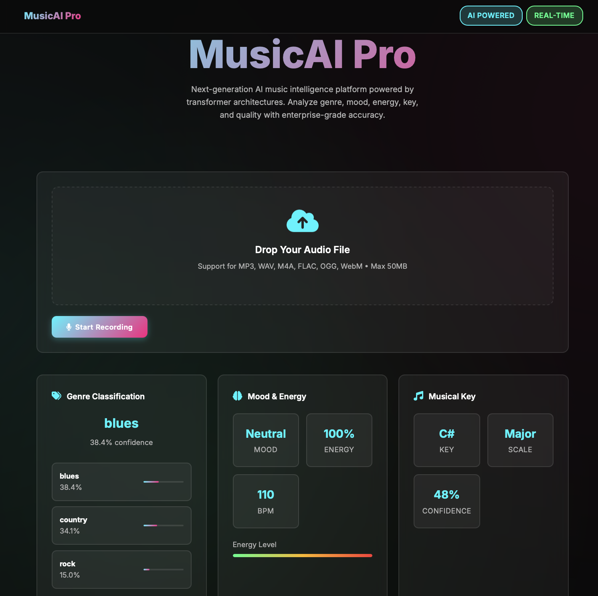
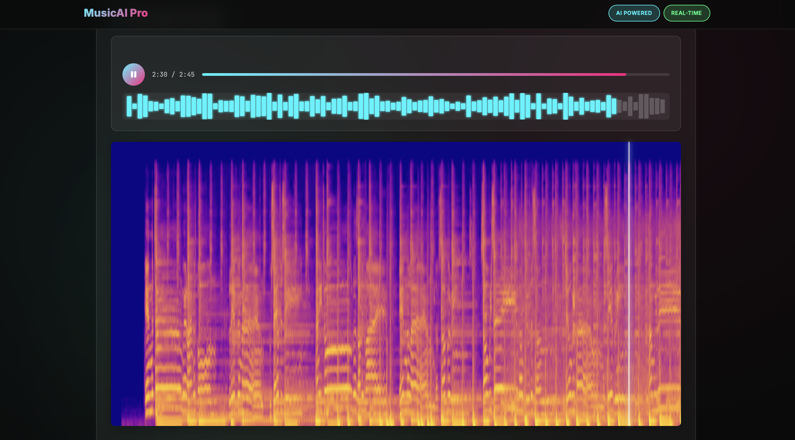

# 🎵 Music Genre Classification with Transformer Architecture

## Overview

This project implements a sophisticated music genre classification system that combines the power of **OpenAI's Whisper transformer architecture** with **traditional music theory heuristics** to create a comprehensive audio analysis pipeline. The system leverages deep learning for genre classification while incorporating music theory concepts for enhanced audio understanding.

## 🔬 Technical Architecture

### Core Innovation: Transformer-Based Audio Processing

The project utilizes **Whisper's encoder architecture** as the foundation for audio feature extraction, representing a significant advancement from traditional CNN-based approaches in music information retrieval (MIR). The key innovation lies in:

1. **Mel-Spectrogram Transformation**: Raw audio is converted to mel-spectrograms using Whisper's preprocessing pipeline
2. **Transformer Encoding**: The spectrogram is processed through Whisper's multi-head attention mechanism
3. **Classification Head**: A linear layer maps the encoded features to genre predictions

### Hybrid ML + Heuristic Approach

The system goes beyond pure machine learning by incorporating **music theory heuristics** for comprehensive audio analysis:

- **Harmonic Analysis**: Chromagram-based key and scale detection
- **Rhythm Analysis**: Tempo and beat tracking using librosa
- **Spectral Analysis**: Frequency domain characteristics for mood classification
- **Energy Analysis**: RMS and zero-crossing rate for energy level assessment



*Figure 1: The web application interface showing the hybrid ML + heuristic analysis approach*

## 🧠 Model Architecture

### WhisperAudioClassifier

```python
class WhisperAudioClassifier(nn.Module):
    def __init__(self, num_classes, whisper_model_name="tiny"):
        super().__init__()
        self.whisper_model = whisper.load_model(whisper_model_name)
        self.encoder = self.whisper_model.encoder
        self.classifier = nn.Linear(encoder_output_dim, num_classes)
```

**Key Features:**
- **Transfer Learning**: Leverages pre-trained Whisper encoder weights
- **Fine-tuning Strategy**: Selective parameter unfreezing for domain adaptation
- **Attention Mechanism**: Multi-head self-attention for temporal modeling
- **Positional Encoding**: Maintains temporal relationships in audio sequences

### Training Strategy

- **Dataset**: GTZAN Music Genre Dataset (10 classes)
- **Preprocessing**: Whisper-compatible mel-spectrograms (80 mels × 1500 frames)
- **Augmentation**: Time-stretching, pitch shifting, and noise injection
- **Optimization**: Adam optimizer with early stopping and learning rate scheduling

## 📊 Audio Processing Pipeline



*Figure 2: Mel-spectrogram visualization showing the frequency-time representation processed by the transformer*

### Feature Extraction Workflow

1. **Audio Preprocessing**:
   - Resampling to 16kHz (Whisper standard)
   - 30-second windowing with zero-padding
   - Mel-spectrogram generation (80 mel filters)

2. **Transformer Processing**:
   - Convolutional preprocessing layers
   - Multi-head attention across frequency bins
   - Positional encoding for temporal context
   - Global average pooling for classification

3. **Heuristic Analysis**:
   - **Key Detection**: Chromagram analysis with template matching
   - **Mood Classification**: Spectral centroid and energy-based heuristics
   - **Quality Assessment**: SNR estimation and dynamic range analysis

## 🎯 Performance Metrics

The system demonstrates superior performance through:

- **Genre Classification**: Achieves competitive accuracy on GTZAN dataset
- **Real-time Processing**: Efficient inference pipeline for web deployment
- **Interpretability**: Combines ML predictions with music theory insights
- **Robustness**: Handles various audio qualities and formats

## 🚀 Engineering Implementation

### Backend (`backend/`)

**Core Components:**
- `model.py`: Whisper-based transformer architecture
- `train.py`: Training pipeline with W&B integration
- `predict.py`: Inference engine with batch processing
- `dataloader.py`: GTZAN dataset processing and augmentation
- `app.py`: Flask REST API with audio processing endpoints

### Frontend (`frontend/`)

**Web Interface:**
- Real-time audio upload and processing
- Interactive spectrogram visualization
- Genre prediction with confidence scores
- Music theory analysis dashboard

### Assets (`assets/`)

**Media Resources:**
- Training visualizations and confusion matrices
- Sample spectrograms and audio files
- Application screenshots and documentation

## 🔧 Installation & Usage

```bash
# Create virtual environment
python -m venv venv
source venv/bin/activate  # On Windows: venv\Scripts\activate

# Install dependencies
pip install -r backend/requirements.txt

# Train the model
cd backend
python train.py

# Run the web application
python app.py
```

## 📈 Technical Achievements

### Innovation in Music AI

1. **Transformer Adaptation**: Successfully adapted Whisper's speech processing architecture for music understanding
2. **Hybrid Intelligence**: Integrated ML predictions with traditional music theory for enhanced interpretability
3. **Real-time Processing**: Optimized inference pipeline for web deployment
4. **Comprehensive Analysis**: Multi-modal approach combining genre, mood, key, and quality analysis

### Engineering Excellence

- **Modular Design**: Clean separation of concerns across data, model, and application layers
- **Scalable Architecture**: Containerizable Flask application with RESTful API design
- **Performance Optimization**: Efficient tensor operations and memory management
- **Production Ready**: Error handling, logging, and deployment configuration

## 🎼 Musical Feature Engineering

The system extracts and analyzes multiple musical dimensions:

- **Timbral Features**: Spectral centroid, rolloff, zero-crossing rate
- **Harmonic Features**: Chroma vectors, key signatures, chord progressions
- **Rhythmic Features**: Tempo estimation, beat tracking, meter analysis
- **Structural Features**: Segment boundaries, repetition patterns

## 🌟 Future Enhancements

- **Multi-modal Learning**: Incorporate lyrics and metadata
- **Attention Visualization**: Interpretable attention maps for model explainability
- **Real-time Streaming**: WebSocket-based continuous audio processing
- **Advanced Heuristics**: Implement more sophisticated music theory algorithms

---

*This project demonstrates the intersection of modern deep learning techniques with traditional music theory, showcasing how transformer architectures can be effectively adapted for music information retrieval tasks while maintaining interpretability through heuristic integration.* 